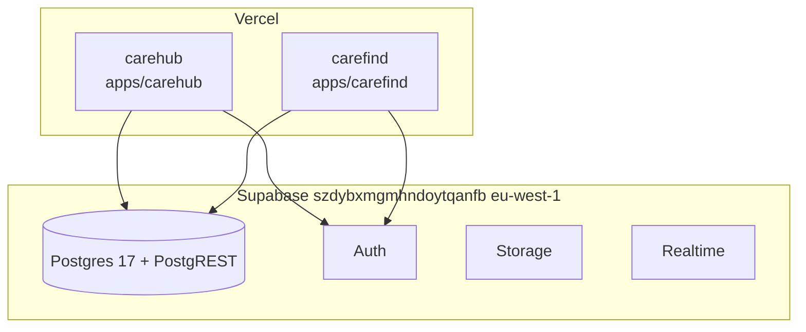
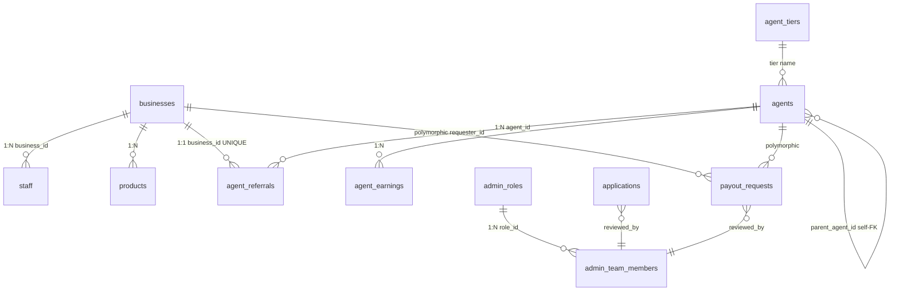

# Architecture Spine — HealthCare-Ecosystem — Super Admin Command Center

## Design Paradigm
**Repository-Seam + RLS Tenant Boundary + Quiet Chrome.** UI → repository (application/domain) → `sbFetch` transport (infrastructure, injected). Two adapters per repository: real PostgREST in prod, in-memory in tests. RLS is the *only* multi-tenant boundary; no client business_id trust. Quiet Chrome: dark-first tokens, color = state only, 36px dense tables, sheet over modal.

Layers map to dirs:
- `pages/admin` — presentation, no direct PostgREST
- `modules/{carefindhub,staff,territories,...}/repositories` — domain, owns scoping, injected `{request, upload, notify}`
- `services/supabase.js` — thin transport `sbFetch/sbUpload/authToken()` — no business rules
- `api/_handlers` — service-role, `SECURITY DEFINER` for money
- `lib/permissions` + `lib/platformPermissions` — single checklist pattern

## Invariants & Rules

### AD-1 — Repository seam is the only data gate [ADOPTED]
- **Binds:** all (CAP-1..7, every write)
- **Prevents:** Unscoped id-only PATCH/DELETE (C19 shape) and scattered data access (AdminPanel 1,868 lines)
- **Rule:** Every read/write goes through a per-module repository with injected transport; `services/supabase.js` is transport only. 16/24 CareHub modules already seam-migrated — extend, don't invent second pattern. New CareHub & CareFind code must seam.

### AD-2 — RLS is the tenant boundary, verified behaviorally
- **Binds:** all (CAP-2,4,5,6)
- **Prevents:** Row-level scoping by client `business_id` param or anon `Allow all` blanket
- **Rule:** `business_id IN (SELECT current_business_ids()) OR is_platform_admin()` per table, with documented exceptions (`rep_territories`, `staff_claims` via parent). Zero-permissive-policy tables are deny-all service-role only. Verification is behavioral: anon probe returns 0, cross-tenant probe returns 0, owner probe returns 1 — not catalog count.

### AD-3 — Financial ops are SECURITY DEFINER + idempotent, never client-calc
- **Binds:** CAP-5,7, payouts
- **Prevents:** Earnings double-pay on webhook retry, non-atomic payout+earnings split
- **Rule:** `calculate_agent_earnings(p_business_id, p_plan_value, p_payment_reference)` and `mark_payout_paid(p_payout_id)` are `SECURITY DEFINER` with `search_path=public,extensions,pg_temp` pinned; earnings idempotent via `UNIQUE(payment_reference,agent_id) WHERE NOT NULL` + `ON CONFLICT DO NOTHING`; payout is row-locked `FOR UPDATE`. Client never computes `amount_owed = plan_value × pct`.

### AD-4 — Dark-first Quiet Chrome with tokens
- **Binds:** CAP-3,6
- **Prevents:** Light-only hardcoded hex, color as decoration, modal overload
- **Rule:** All color via CSS vars (`--bg,--panel,--border,--teal,--amber,--green,--red`) with `data-theme` and `prefers-color-scheme`; color tokens only for state (amber pending, green active, red suspended, gray revoked). 36px rows, 13px body, tabular numbers right-aligned, sheet (40% width / bottom sheet 50% mobile) not modal, 12-col `auto-rows:minmax(200px,auto)`.

### AD-5 — Permission is one checklist pattern, two matrices
- **Binds:** CAP-4
- **Prevents:** Second unrelated role/permission implementation
- **Rule:** Both `lib/permissions.js` (business `ROLES/DEFAULT_STAFF_PERMS/buildCustomPerms/getPerms/navCatalogueFor`) and `lib/platformPermissions.js` (8 `PLATFORM_PERMISSIONS`) share `normalize`/`navCatalogueFor` shape; `admin_roles.permissions jsonb` is the source; hiring picks existing `role_id` dropdown, never inline perms; nav filtering is presentation, RLS + service-role check is enforcement.

### AD-6 — Module registry is single source for nav/guard/editor
- **Binds:** CAP-1,2,4
- **Prevents:** Sidebar/guard/editor drift (consultation offered in one surface, missing in another)
- **Rule:** `MODULES[id].types` gates, `NAV_ORDER` only orders; `getModulesForType` → `getNavItems` → `getNavGroups` + `isModuleActive`. Adding a module = registry entry + `REPORT_TABS` if reporting.

### AD-7 — State stays predictable, no global cache yet
- **Binds:** all
- **Prevents:** Hidden global mutation, stale cache as source of truth
- **Rule:** One `AuthContext` (persisted `localStorage['carehub_auth']` + `authClient.getSession()` reconciliation); everything else `useState` per page, refetch on mount, no React Query/SWR. Offline sales queue is the only exception (`localStorage` idempotent replay via `saleRepository`). TanStack Query is Deferred.

### AD-8 — Supabase is the platform, Vercel per app, env-based config
- **Binds:** all
- **Prevents:** Hardcoded anon keys, key rotation requiring code deploy, two-apps sharing one Vercel project
- **Rule:** `POSTGRES 17` on `szdybxmgmhndoytqanfb (eu-west-1)`, PostgREST + Auth + Storage + Realtime. `apps/carehub` and `apps/carefind` are independent Vite SPAs with `apps/<app>/vercel.json`, `rootDirectory` per app, `@care-ecosystem/shared-*` packages. `VITE_SUPABASE_URL/ANON_KEY` via `apps/*/config/supabase.js` from `.env`; service-role only in `api/*.js` via `process.env.SUPABASE_SERVICE_ROLE_KEY`.

### AD-9 — Migrations are tracked, not loose files, verified by re-read
- **Binds:** all
- **Prevents:** DDL completing ≠ applied (C19 `DROP POLICY IF EXISTS` wrong name, `REVOKE FROM PUBLIC` not touching `anon`, `CREATE OR REPLACE` sibling)
- **Rule:** New DDL via `supabase migration new` → `supabase/migrations/` (CLI), not `apps/*/sql/` loose; CI gates `supabase db push --dry-run`. Verification re-reads `pg_policies/pg_proc.proacl/information_schema` + behavioral probe, never `IF EXISTS` count alone. `phase2_rls_pilot` naming is canonical; new policies use `qual='true'` drop-by-predicate if needed.

### AD-10 — Command palette is the power-user path, table is the product
- **Binds:** CAP-1,2
- **Prevents:** 7 equal tabs, card-only businesses, job labels as data categories
- **Rule:** Global `Cmd+K` (`cmdk` + `command-score`, fuzzy, <5ms for 1k) over businesses/agents/applications/payouts; recent commands top; mnemonic shortcuts (`A` approve, `R` revoke, `P` pay) shown in palette. Businesses is dense table primary, card is mobile fallback; Coverage map is interactive territory assignment respecting 20-cap.

```mermaid
flowchart TB
  UI[pages/admin<br>presentation] --> Repo[modules/*/repositories<br>domain]
  Repo --> SB[services/supabase<br>sbFetch/sbUpload/authToken]
  SB --> PG[(PostgREST<br>Supabase Postgres 17)]
  API[api/_handlers<br>service-role] --> PG
  PG --> RLS{RLS<br>current_business_ids()}
  RLS --> Ledger[Ledger aggregate<br>not source]
```

## Consistency Conventions

| Concern | Convention |
|---|---|
| Naming (entities, files, interfaces, events) | `businesses` owns tenant; `staff_claims` via parent; `agent_tiers (agent/community_coordinator/state_coordinator/unplaced)`; `agent_referrals UNIQUE(business_id)`; events `staff_notifications.kind` (e.g. `activity`/`out_of_stock`) |
| Data & formats (ids, dates, error shapes, envelopes) | `uuid` PK `gen_random_uuid()`, `timestamptz` UTC, `numeric(14,2)` money, `sbFetch` throws `Supabase error (status): detail` with parsed JSON message, `Prefer: return=minimal` for anon writes |
| State & cross-cutting (mutation, errors, logging, config, auth) | Local `useState` + `useToast` (responsive bottom-center/top-right) + `Loading/ErrorState/Empty` on every panel; `confirm()` replaced by `ConfirmDialog` danger variant; no `alert/prompt`; `theme` tokens only, `lucide-react` icons |
| Auth | CareHub custom `register_business/provision_staff_auth` SECURITY DEFINER minting confirmed `auth.users`; login `signInWithPassword` → `resolveAccountByEmail`; `admin_team_members` parallel lane with same pattern |
| Testing | Vitest + Testing Library, in-memory adapter per repository, `apps/carehub/src/services/__tests__` for auth/seam, no `__tests__` for UI unless behavior non-trivial |

## Stack

| Name | Version |
|---|---|
| React | 18.2.0 |
| Vite | 5.4.21 |
| Supabase JS | 2.45.0 |
| Supabase Postgres | 17 |
| Vitest | 2.1.9 |
| jsdom | 29.1.1 |
| lucide-react | 1.25.0 |
| qrcode, gsap | 1.5.4, 3.15.0 |
| Vercel | 58.4.4, Node 24.x, `rootDirectory: apps/carehub` |
| Supabase CLI | latest (for `supabase/migrations/`) |

## Structural Seed

```text
HealthCare-Ecosystem/
  apps/
    carehub/  # Vite SPA, 304 modules, repository-seam, theme tokens
      src/{pages/{admin,agent,auth,dashboard},modules/{pos,inventory,staff,carefindhub/panels},lib/{permissions,platformPermissions},services/supabase,config/supabase}
      sql/    # legacy loose, migrating to supabase/migrations/
      api/_handlers/  # service-role, SECURITY DEFINER RPCs
    carefind/  # Vite SPA, flat → seam next (admin/wallet first)
  packages/shared-marketplace, shared-notifications
  _bmad-output/
    brainstorming/brainstorm-carehub-admin-dashboard-2026-09-06/
    specs/spec-carehub-admin-dashboard/
    planning-artifacts/architecture/architecture-HealthCare-Ecosystem-2026-09-06/
  supabase/migrations/  # target (CLI-tracked)
```



Core ER — Super Admin slice (names + FKs only):



## Capability → Architecture Map

| Capability / Area | Lives in | Governed by |
|---|---|---|
| CAP-1 Cmd+K Command Center | `pages/admin` (AdminDashboard + `kbar/cmdk` registry) | AD-1, AD-6, AD-10 |
| CAP-2 Businesses table+sheet | `pages/admin` BusinessesPanel + `ecommerce_products` | AD-1, AD-2, AD-4 |
| CAP-3 Capped KPIs+trend | `pages/admin` DashboardStats | AD-4, AD-7 |
| CAP-4 Matrix perms+vault | `lib/platformPermissions` + `admin_roles` + `mark_payout_paid` | AD-3, AD-5 |
| CAP-5 Statement+Daily Brief | `pages/admin` LedgerPanel + `lib/carefindhubExports` | AD-3 |
| CAP-6 Dark-first 12-col realtime | `styles/theme` + `supabase.realtime` | AD-4, AD-7, AD-8 |
| CAP-7 Coverage map+graph | `pages/admin` CoveragePanel + `agent_tiers` | AD-2, AD-3 |
| Financial atomicity | `api/_handlers` + `calculate_agent_earnings` | AD-3, AD-9 |
| Deploy & env | `vercel.json` per app + `config/supabase` | AD-8, AD-9 |

## Deferred

- **React Query/SWR** — every navigation refetches; P2, not correctness; start with Dashboard/POS product list incrementally.
- **Sentry/error tracking** — no tool chosen; cheapest silent-breakage close is next after CI.
- **E2E Playwright** — zero coverage; scope to `register→login→first sale`, `requisition create→approve`, `payout pending→paid` per roadmap.
- **Route code-splitting** — CareHub 2.09 MB single chunk, >500 kB warning; split per route after seam.
- **TypeScript blanket** — keep JS, scope new modules only if needed; no repo-wide conversion.
- **Microservices/queue/mesh** — out of scope at this team/load; Vite SPA + Postgres is the right scale.
- **Formal `supabase/migrations/`** — P1, blocks safe CI; until then loose `sql/` + MCP `apply_migration` + re-read verification.
- **Ops docs** — `DEPLOYMENT.md`, `.env.example` per app, `INCIDENT-RESPONSE.md` — near-zero effort, P2.
