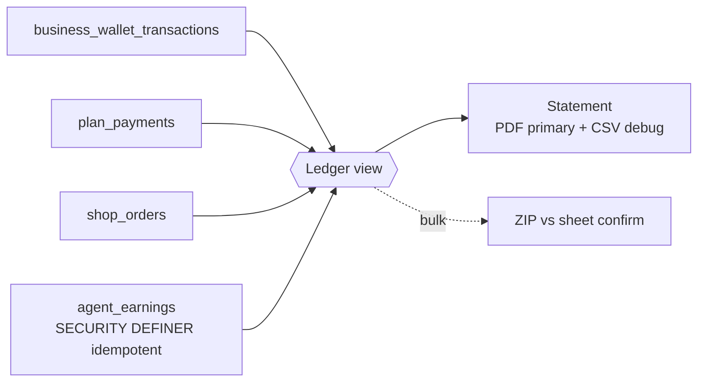
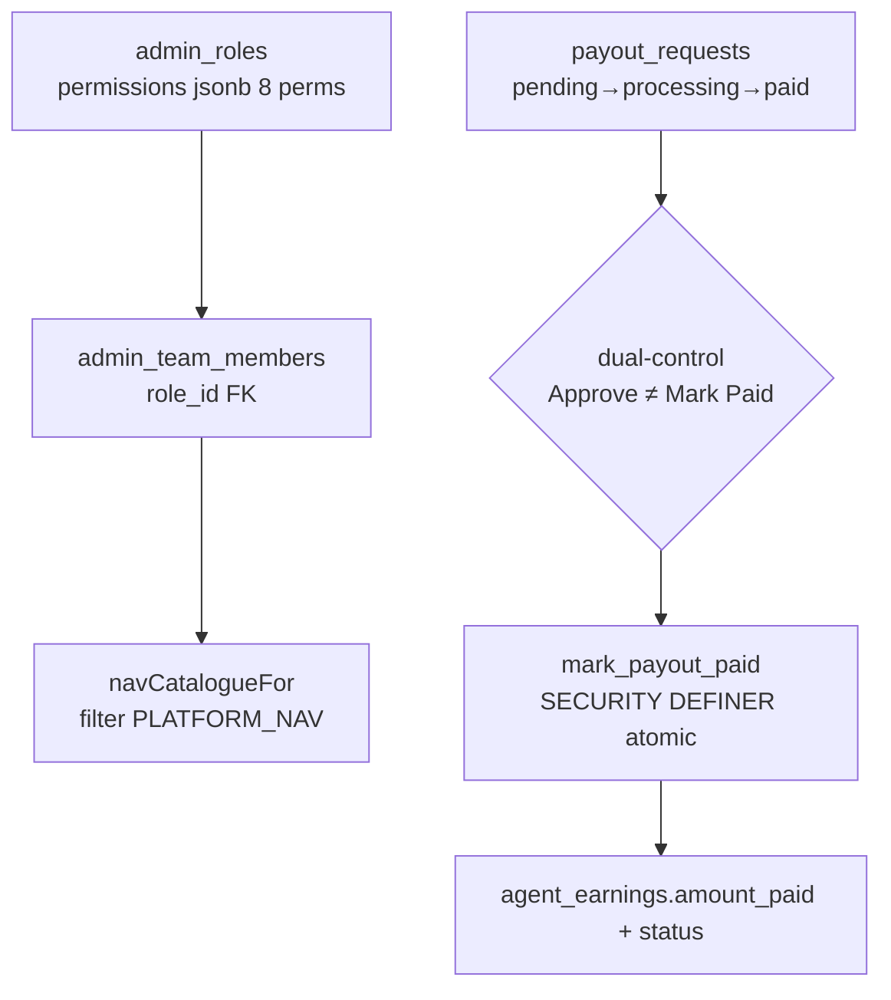

# Architecture Diagrams — CareHub Super Admin Dashboard

## Layout — Rail + 12-col Grid + Sheet

```mermaid
flowchart TB
  subgraph Chrome[Chrome — quiet, dark-first]
    Rail[64px rail<br>64px collapsed<br>tooltips + Cmd+K]
    Sidebar[256px sidebar<br>expandable<br>breadcrumbs]
  end
  subgraph Page[Page template — Supabase console pattern]
    KPIs[6-cap KPI strip<br>hero Pending + sparkline]
    Brief[Daily Brief AI card<br>Attio style]
    Grid[12-col grid auto-rows:minmax(200px,auto)]
    CmdK[Cmd+K palette<br>cmdk + command-score]
  end
  subgraph Detail[Detail]
    Table[Stripe dense table<br>36px rows, sticky header]
    Sheet[Linear side sheet 40%<br>bottom sheet mobile 50%]
    Timeline[Timeline pending→active→sus→rev→reapply]
  end
  Rail --> Sidebar --> KPIs --> Brief --> Grid --> Table --> Sheet --> Timeline
  CmdK -.-> Table & Sheet
```

## Data — Ledger Aggregate (not source)



## Perms — Matrix + Vault



## Tokens — Dark-first

```css
:root{--bg:#0a0a0b;--panel:#111113;--border:#232326;--teal:#14b8a6}
[data-theme='light']{--bg:#ffffff;--panel:#f8f8f8;--border:#e4e4e7}
/* color = state only */
.status-pending{color:var(--amber)} .status-active{color:var(--green)}
```

## Realtime — Pulse not Poll

```
30s poll  →  supabase.realtime channel on businesses(*) + payouts(*)
            badge pulse dot + last-synced + duration
```
